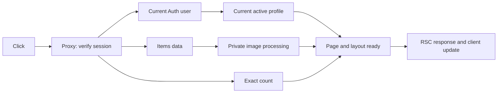

# CAMMS latency investigation — round 2, 2026-09-10

## ROOT CAUSE

**เวลาหลักที่ผู้ใช้รออยู่ฝั่งเซิร์ฟเวอร์: การเรียก Supabase ที่ช้าและผันผวน โดย Auth → Profile ต่อกันเป็น critical path ไม่ใช่หลักฐานว่า React rendering หรือ index เป็นสาเหตุหลัก**

The production symptom was reproduced with an existing authenticated browser session. A repeated Dashboard → Items navigation took 9.484 seconds from the automation click to the observed Items heading. Its server logs show **5,101.101 ms Auth followed by 4,136.032 ms profile lookup**, while Items data/count already execute in parallel. This 9,237.133 ms sequential branch holds the page back.

**The infrastructure evidence now points to resource pressure on Supabase Nano.** At approximately 09:25 UTC the project's own dashboard reported `Unhealthy` and “Your project is currently exhausting multiple resources, and its performance is affected.” It showed `t4g.nano`, up to 0.5 GB memory, shared CPU, CPU 44%, RAM 83%, disk 15%, and 19/60 connections. The Database report showed memory usage 408.39 MB and memory commitment 1.9 GB; committed memory is not the same as resident memory. Several detailed CPU/IO charts failed to load, so CPU-credit exhaustion, swap activity and the exact queue responsible are **not measured**.

This is a measured server critical path plus provider-reported infrastructure pressure. A controlled compute-size change has **not** been performed, so an improvement attributable to resizing is **not yet proven**. Do not describe this investigation as a completed production fix.

## EVIDENCE

Production deployment `dpl_2SGHZ3TR8X15k6TH4uDoNRoFfKnN` runs commit `6d66c1f36aa5aac56eae416238ab22a1771e4725`, region `sin1`. It does **not** include the previous turn's uncommitted worktree changes. The connected CAMMS database is in `ap-southeast-1`; actual counts are 1 item and 5 profiles.

Controlled tests reused existing endpoints, adding no diagnostic route:

- `/api/health/liveness`: dynamic Next.js handler, no Auth, DB, dashboard layout, React page or realtime.
- `/api/health/readiness`: same app/server, existing service-role `profiles.select('id').limit(1).maybeSingle()` and one bounded Storage listing, timed individually and run in parallel. This isolates service overhead; it does **not** represent user RLS, valid-session Auth, Items or signing.
- `/login` and unauthenticated `/items`: additional HTML/proxy controls. An unauthenticated redirect is not an Items page measurement.
- Direct public JWKS and HTTPS service-role profile query: no Next.js, React, realtime or Supabase SDK. Query results and credentials were not recorded.

| Production service check | First sample | Subsequent samples 2–5 |
|---|---:|---|
| Liveness HTTP total | 926.459 ms | 76.454, 206.391, 86.528, 83.755 ms |
| Readiness DB timer, one projected profile | 1,049 ms | 642, 375, 239, 331 ms |
| Readiness Storage timer | 508 ms | 239, 50, 286, 162 ms |
| Readiness HTTP total | 1,146.457 ms | 734.386, 456.344, 368.432, 410.600 ms |

The exact normalized readiness profile statement recorded 10 executions, 16.238827 ms **total SQL execution**, mean 1.623883 ms, maximum 2.777196 ms. Ten calls match the five local plus five production readiness requests. The service timers are much larger than the SQL execution portion.

In a separate authenticated Settings navigation at 09:15:58 UTC, the normalized profile-by-ID counter increased from 124 to 125 and total execution from 2405.858772 to 2410.330438 ms: **one execution, 4.471666 ms**. The matching route log measured that profile operation at **1,634.952261 ms**. This is an interval-correlated statement counter, not a distributed trace ID; no reset was performed.

Raw controls: [health-results.json](./health-results.json), [network-results.json](./network-results.json), [tls-results.json](./tls-results.json), [dev-results.json](./dev-results.json). In `health-results.json`, `startedUtc` was recorded after response JSON was consumed; treat it as observation time, not exact request start. Other duration fields use a monotonic clock.

## REQUEST TIMELINE

One production Items request, grouped by Vercel under 09:14:16 UTC:

| Operation | Logged duration | Relationship |
|---|---:|---|
| Proxy JWT/session verification | not measured for this request | Before page; missing slow log does not mean zero |
| `auth.getCurrentUser` | 5,101.101 ms | Ends 09:14:21.780 |
| `auth.getCurrentProfile` | 4,136.032 ms | Starts after Auth, ends 09:14:25.917 |
| `items.getItems.data` | 7,019.499 ms | Starts alongside Auth, ends 09:14:23.699 |
| `items.getItems.count` | 4,133.649 ms | Starts alongside data/Auth, ends 09:14:20.813 |
| Private image signing | not measured separately | After data query; do not infer zero |
| Layout-only work / serialization / RSC transfer / React rendering | not measured separately | Not available from existing production trace |
| Auth → profile branch | **9,237.133 ms** | Sum of these two sequential measured calls |
| Click → observed Items heading | **9,484 ms** | Automation observation, includes tool/poll overhead; not browser Performance API |

Do **not** sum the parallel data and count durations into the total. Browser and server wall clocks are not synchronized for fine-grained subtraction.

On Reports, the current source instead awaits profile before launching report queries. The measured 09:13:27 Dashboard request had Auth 1,099.096 ms → profile 1,127.321 ms → parallel low-stock 1,180.719 ms / stats 1,183.633 ms. These shared service round trips explain delays on more than one route.

## CHANGES MADE

No additional application refactor, Auth relaxation, RLS change, index, dependency, realtime removal, compute change or deployment was made in this round. The deliverables are the investigation and measurement evidence. Earlier worktree changes remain intact.

Temporary probes used the existing health endpoints and bounded read-only requests. They added no public diagnostic endpoints, mock sessions, permission bypasses or production logging. Diagnostic scripts were removed after their measurements; JSON evidence remains. Local diagnostic servers were stopped.

## BEFORE / AFTER

There is **no after-fix benchmark** because no infrastructure intervention has been applied. The earlier synthetic 20,000-row RLS improvement must not be used as evidence that this one-item production incident is fixed.

| Control | First sample | Second | Third |
|---|---:|---:|---:|
| Local production `/login`, total HTTP | 168.624 ms | 8.971 ms | 8.661 ms |
| Local development `/login`, total HTTP | 9,761.380 ms | 598.481 ms | 61.249 ms |
| Local development liveness, total HTTP | 6,543.081 ms | 189.120 ms | 23.306 ms |
| Deployed `/login`, total HTTP without session | 851.748 ms | 75.025 ms | 71.006 ms |

Development logs attributed about 9.0 seconds of first Login rendering to Next.js compilation. Development first-load overhead is real, but authenticated **production** slowness was also reproduced. First samples include connection/module/cache startup; they are not pure isolated serverless cold-start measurements.

## DATABASE

`pg_stat_statements` is available; statistics reset timestamp is 2026-09-09 06:10:57 UTC. Planning and IO timing tracking are disabled. Accordingly, SQL execution excludes planning, connection acquisition, PostgREST handling, network and application scheduling. The approximately 1.63-second profile gap is **outside measured SQL execution**, not a proven pure network measurement. See the [PostgreSQL statistics definitions](https://www.postgresql.org/docs/current/pgstatstatements.html).

Read-only owner-role EXPLAIN controls, not authenticated-page plans:

- `profiles SELECT id LIMIT 1`: one-row sequential scan, planning 5.315 ms, execution 4.546 ms, one shared-hit block, no disk reads.
- Items six-column OR/ILIKE search, sorted first ten: scans the single existing row, removes it by filter, in-memory quicksort, planning 182.766 ms, execution 23.559 ms, seven shared-hit blocks, no disk reads. Trigram indexes were not used in this tiny-table plan; this is not evidence to add another index.
- Snapshot showed no blocked application statements, no deadlocks and no temp bytes. This single snapshot does not rule out earlier transient waits; zero IO timing with tracking disabled is not zero IO.

Historical normalized RPC execution was not free: report stats mean 388.289 ms/max 3405.949 ms over 21 calls; sidebar stats mean 194.914 ms/max 775.967 ms over 13 calls. Those are aggregate historical figures, not the execution times of the timeline above. They may also be affected by instance pressure.

## AUTH

Production still uses proxy SDK `getClaims`, server `getUser`, and a current active-profile lookup. Those checks were preserved. The interval-correlated Settings experiment observed **one** profile query, not duplicated profile queries.

Existing production logs record only operations over the 1,000 ms slow threshold. Therefore total successful remote Auth HTTP requests, refresh/JWKS requests and below-threshold operations per navigation are **not measured**. A public ES256 JWKS does not prove the signing algorithm of the existing browser session. No session token was inspected or copied.

The main measured amplification is **sequential latency**, not a proven excess count of authentication requests. Parallelizing or caching permission checks without demonstrating preserved freshness would be the wrong next step.

## NETWORK / INFRASTRUCTURE

Vercel deployment and Supabase are both Singapore. A region mismatch is not supported by their current configuration.

Direct HTTPS socket timings from the local host: first DNS completion 27.502 ms, TCP completion 31.061 ms and TLS completion 63.713 ms, all cumulative from request start. First JWKS byte arrived at 730.562 ms. Subsequent profile reads reused the TLS socket and still took 452–741 ms. Thus repeatedly paying DNS/TLS establishment cannot explain all of this control's delay. Local-host timings are not Vercel-to-Supabase timings.

The [project infrastructure page](https://supabase.com/dashboard/project/qrlwduggtczovaebukdp/settings/infrastructure) showed Free/Nano and required Pro to change compute. A separate generic banner mentioned a free Micro upgrade for Pro; that is **not** proof this Free organization can upgrade without charge. Do not purchase or resize based on the banner alone.

The evidence-supported next intervention is a **controlled Nano → Micro comparison**, preserving app code, region, data, RLS and Auth, then rerunning the same health and authenticated-navigation measurements. It requires a billing decision and a maintenance window. Supabase documents shared CPU and 1 GB memory for Micro, and notes compute changes cause downtime; consult [Compute and Disk](https://supabase.com/docs/guides/platform/compute-and-disk). No payment, subscription, restart or resize was performed.

## CLIENT

Authenticated Dashboard → Items → Reports → Settings → Dashboard was exercised on the deployed commit. Settings observations were 4,233 ms and 5,196 ms on separate visits. Returning to the Dashboard welcome heading took 2,429 ms; its metrics were still streaming, so this is not full-page-ready timing. The repeated Items observation was 9,484 ms. Reports exceeded a three-second locator wait and was visible on a later observation; exact Reports completion time is **not measured**.

Search for a nonexistent value returned zero rows. Clearing search restored the row; the Spare filter returned zero and clearing it restored one. Console error/warning collection for that test tab was empty. There is only one item, so next-page navigation is disabled; no production rows were inserted to manufacture a pagination benchmark. Create/edit writes were not exercised on production data.

Browser Performance entries were unavailable through the connected read-only automation API. RSC bytes, React commits, hydration, long tasks and true interaction-to-next-paint are **not measured**. No frontend performance conclusion is based on automation overhead alone.

The no-UI/no-realtime health control still exhibits slow service waits. This proves those UI layers are not necessary to reproduce service overhead; it does not quantify a full-page Realtime ON/OFF difference. The requested full-UI/mock-data and realtime-toggle matrix was not run against production; no bypass was introduced to imitate it.

The local production build remains within existing bundle budgets: shared runtime 436.25 KiB raw / 128.16 KiB gzip, dashboard entries 88.95 / 29.79 KiB. These are manifest sizes, not measured browser transfer or CPU time.

## REMAINING BOTTLENECKS

1. **P0: Supabase resource pressure and variable service round trips.** Provider warning plus independent controls and real-navigation traces support addressing this first. Exact attribution among CPU scheduling, memory/swap, service queues and untracked planning requires provider metrics; failed charts were not filled with guesses.
2. **P1: Sequential Auth → profile cost.** Preserved for security. Reassess only after service latency is healthy; current data does not justify bypassing either check.
3. **P2: Cold development compilation.** Measured independently; it does not explain the production incident.
4. **Unverified impact of prior changes.** They remain local. Neither deploying them nor adding more indexes has been demonstrated to remedy the measured infrastructure pressure.

Success criteria for the next intervention: compare identical first/second/third samples plus at least five warm navigations, retain current security checks, confirm the resource warning clears, and compare service durations and user-visible completion. If resizing does not materially improve those results, investigate provider-side queues/planning rather than retaining an unsupported performance claim.

## TEST RESULTS

| Command / check | Actual result |
|---|---|
| `npm run typecheck` | Passed |
| `npm run lint` | Passed |
| `npm run build` | Passed, including bundle budgets |
| `npm test` | 500 passed across 125 files; 0 failed, 0 skipped |
| Authenticated deployed navigation, search and filter | Observed successful results, with latency as documented above |
| Browser console for final Search/Filter tab | No captured errors or warnings |
| Create/edit and multi-page production flow | Not exercised: real data and only one item |

Browser checks were performed against the live deployed commit; local automated checks cover the current worktree. They are different revisions and must not be conflated. Build, lint, typecheck and tests ran serially after the local diagnostic servers stopped. No test timeout or assertion was weakened. No new performance fix is claimed.
